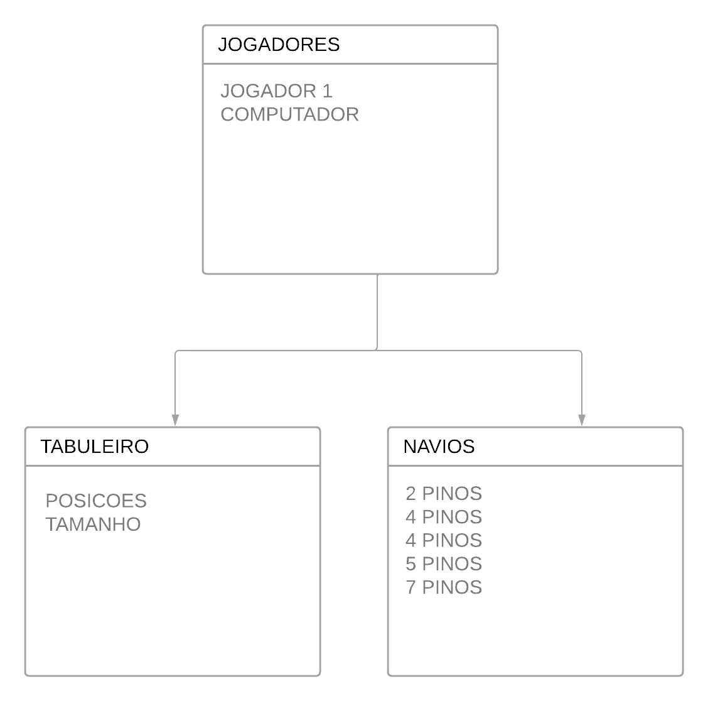

 Trabalho final de Programção orientação a objetos, tem o objetivo de implementar o conteúdo aprendido em sala de aula. Para essa aplicação será desenvolvido um jogo de batalha naval, onde o jogo abre duas janelas (tabuleiros dos jogadores), os jogadores escolhem os lugares onde os barcos irão ficar e então a batalha se inicia.
 
