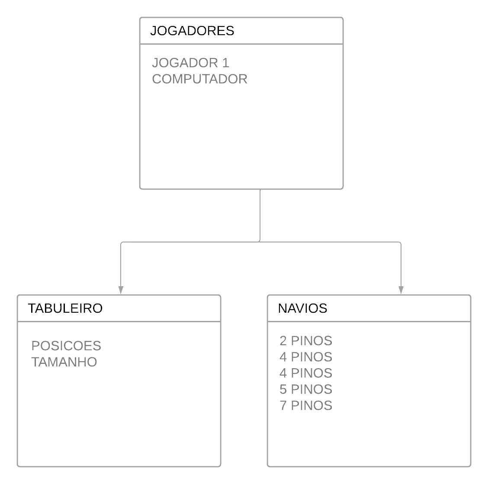

 Trabalho final de Programção orientação a objetos, tem o objetivo de implementar o conteúdo aprendido em sala de aula. Para essa aplicação será desenvolvido um jogo de batalha naval, onde o jogador dois será o computador que aloca os navios e joga as bombas de forma aleatória.
 
